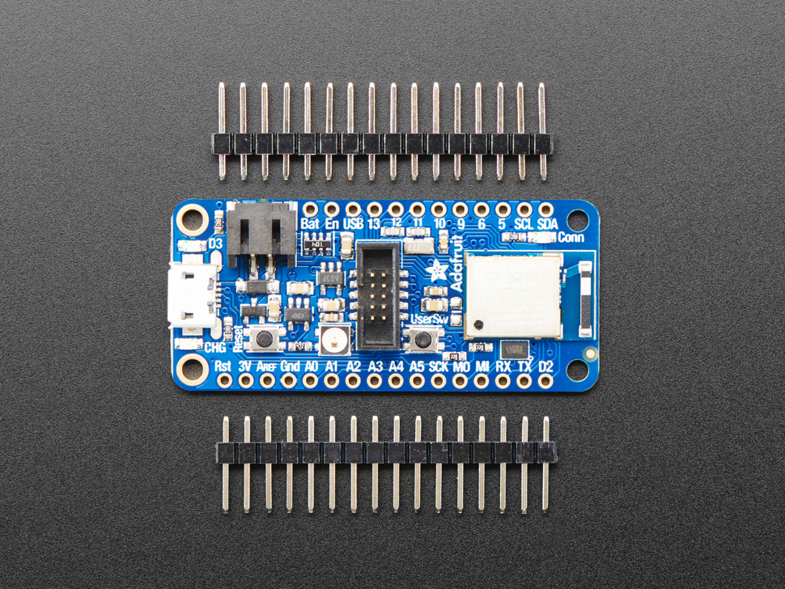

# MOONBOARD LED SYSTEM ARDUINO + NRF52

This repo contain an Arduino sketch implementing the moonboard LED system for a Nordic nrf52840 BLE mcu.

## Part list

- 200 (4x50) WS2811 
- [Adafruit nrf52 express](https://www.adafruit.com/product/4062)
- 3A 5V usb power supply or  5V (> 15W) power supply
- wire + wire connectors

## Led stripes connection

Beware that LED stripes wire colors can be different.  Soldering necessary

- Data (yellow green) -> PIN6
- Ground (blue) -> Gnd
- Power (brown) -> USB PIN

## Power

if using a USB power adapter
- via USB connector

if using an external power supply
- GND to Gnd (parallel to led stripes)
- +5V to USB (parallel to led stripes)

## TODO

- bring out a RESET  or forcer DISCONNECT  button.
- implement different LED layouts selectable via dip switch.
- set led brigntness 
- implement led test
- vsc devcontainer development framework and CI  
